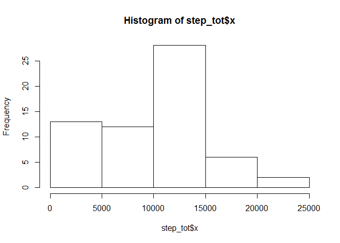
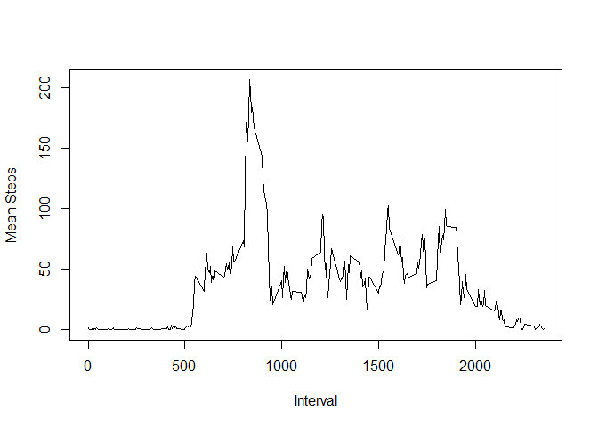
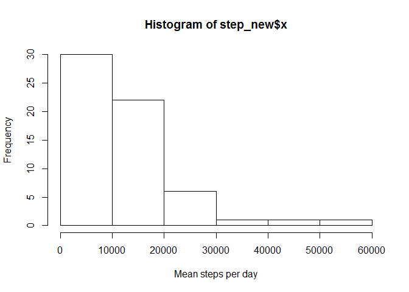
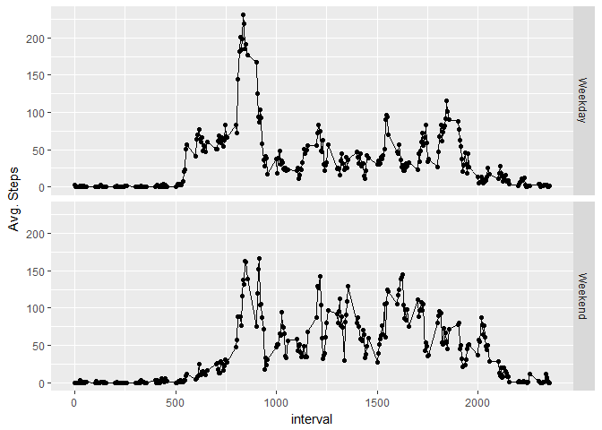

<<<<<<< HEAD
# Reproducible Research: Peer Assessment 1


## Loading and preprocessing the data
Set working directory.  *Be sure* to edit if reproducing.


```r
setwd("~/GitHub/RepData_PeerAssessment1")
```

Unzip file, read csv file, and check structure

```r
unzip("activity.zip")
activity<-read.csv("activity.csv")
str(activity)
```

```
## 'data.frame':	17568 obs. of  3 variables:
##  $ steps   : int  NA NA NA NA NA NA NA NA NA NA ...
##  $ date    : Factor w/ 61 levels "2012-10-01","2012-10-02",..: 1 1 1 1 1 1 1 1 1 1 ...
##  $ interval: int  0 5 10 15 20 25 30 35 40 45 ...
```

## What is mean total number of steps taken per day?
Sum total steps for each day ignoring NAs.  Create histogram of results.

```r
step_tot<-aggregate(activity$steps,by=list(date=activity$date),FUN=sum,na.rm=TRUE)
hist(step_tot$x)
```

<!-- -->
Most days fall between 10,000 and 15,000 steps per day

Calculate mean and median steps taken per day

```r
mean(step_tot$x,na.rm=TRUE)
```

```
## [1] 9354.23
```

```r
median(step_tot$x,na.rm=TRUE)
```

```
## [1] 10395
```


## What is the average daily activity pattern?
Calculate mean steps for interval period across all days.

```r
step_int<-aggregate(activity$steps,by=list(interval=activity$interval),FUN=mean,na.rm=TRUE)
plot(step_int$interval,step_int$x,xlab="Interval",ylab="Mean Steps",type="l")
```

<!-- -->
It appears that the most active interval is around 800.  Confirm with calculating max.

```r
t<-max(step_int$x)
step_int[step_int$x==t,]
```

```
##     interval        x
## 104      835 206.1698
```
Most active interval is 8:35 am

## Imputing missing values
How often is data missing (NA) in the dataset?

```r
sum(is.na(activity$steps))
```

```
## [1] 2304
```

Need strategy to impute missing step values.  Propose using the mean steps for the interval.
Will use mean steps for interval and join to original data set.  They will calculate imputed steps if NA.

```r
step_merge<-merge(activity,step_int)
step_merge$imp<-ifelse(is.na(step_merge$steps),step_merge$x,step_merge$steps)
head(step_merge)
```

```
##   interval steps       date        x      imp
## 1        0    NA 2012-10-01 1.716981 1.716981
## 2        0     0 2012-11-23 1.716981 0.000000
## 3        0     0 2012-10-28 1.716981 0.000000
## 4        0     0 2012-11-06 1.716981 0.000000
## 5        0     0 2012-11-24 1.716981 0.000000
## 6        0     0 2012-11-15 1.716981 0.000000
```

Calculate total steps for each day, to create histogram

```r
step_new<-aggregate(step_merge$imp,by=list(date=activity$date),FUN=sum,na.rm=TRUE)
hist(step_new$x,xlab="Mean steps per day")
```

<!-- -->

Calculate mean and median imputed steps

```r
mean(step_new$x)
```

```
## [1] 10766.19
```

```r
median(step_new$x)
```

```
## [1] 10351.62
```
Both mean and median steps have increased due to this imputation logic


## Are there differences in activity patterns between weekdays and weekends?
Need to calculate weekdays after converting "date" to posix


```r
step_merge$days<-weekdays(strptime(step_merge$date,"%Y-%m-%d"))
table(step_merge$ days)
```

```
## 
##    Friday    Monday  Saturday    Sunday  Thursday   Tuesday Wednesday 
##      2592      2592      2304      2304      2592      2592      2592
```
Looks like we have more data for weekdays than weekends.  Calculate new field as factor to flag weekend vs weekday.


```r
step_merge$type<-as.factor(ifelse(step_merge$days %in% c("Saturday","Sunday"),"Weekend","Weekday"))
table(step_merge$type)
```

```
## 
## Weekday Weekend 
##   12960    4608
```

Calculate total steps per day

```r
step_type<-aggregate(step_merge$imp,by=list(type=step_merge$type,interval=step_merge$interval),FUN=mean)
head(step_type)
```

```
##      type interval          x
## 1 Weekday        0 2.25115304
## 2 Weekend        0 0.21462264
## 3 Weekday        5 0.44528302
## 4 Weekend        5 0.04245283
## 5 Weekday       10 0.17316562
## 6 Weekend       10 0.01650943
```

Plot average steps per interval for weekdays vs Weekends.

```r
library(ggplot2)
```

```
## Warning: package 'ggplot2' was built under R version 3.2.5
```

```r
qplot(interval,x,data=step_type,facets=type~.,ylab="Avg. Steps")+geom_line()
```

<!-- -->

=======
# Reproducible Research: Peer Assessment 1


## Loading and preprocessing the data
Set working directory.  *Be sure* to edit if reproducing.


```r
setwd("~/Coursera/Reproducible Research/RepData_PeerAssessment1-master/RepData_PeerAssessment1-master")
```

Unzip file, read csv file, and check structure

```r
unzip("activity.zip")
activity<-read.csv("activity.csv")
str(activity)
```

```
## 'data.frame':	17568 obs. of  3 variables:
##  $ steps   : int  NA NA NA NA NA NA NA NA NA NA ...
##  $ date    : Factor w/ 61 levels "2012-10-01","2012-10-02",..: 1 1 1 1 1 1 1 1 1 1 ...
##  $ interval: int  0 5 10 15 20 25 30 35 40 45 ...
```

## What is mean total number of steps taken per day?
Sum total steps for each day ignoring NAs.  Create histogram of results.

```r
step_tot<-aggregate(activity$steps,by=list(date=activity$date),FUN=sum,na.rm=TRUE)
hist(step_tot$x)
```

<!-- -->
Most days fall between 10,000 and 15,000 steps per day

Calculate mean and median steps taken per day

```r
mean(step_tot$x,na.rm=TRUE)
```

```
## [1] 9354.23
```

```r
median(step_tot$x,na.rm=TRUE)
```

```
## [1] 10395
```


## What is the average daily activity pattern?
Calculate mean steps for interval period across all days.

```r
step_int<-aggregate(activity$steps,by=list(interval=activity$interval),FUN=mean,na.rm=TRUE)
plot(step_int$interval,step_int$x,xlab="Interval",ylab="Mean Steps",type="l")
```

<!-- -->
It appears that the most active interval is around 800.  Confirm with calculating max.

```r
t<-max(step_int$x)
step_int[step_int$x==t,]
```

```
##     interval        x
## 104      835 206.1698
```
Most active interval is 8:35 am

## Imputing missing values
How often is data missing (NA) in the dataset?

```r
sum(is.na(activity$steps))
```

```
## [1] 2304
```

Need strategy to impute missing step values.  Propose using the mean steps for the interval.
Will use mean steps for interval and join to original data set.  They will calculate imputed steps if NA.

```r
step_merge<-merge(activity,step_int)
step_merge$imp<-ifelse(is.na(step_merge$steps),step_merge$x,step_merge$steps)
head(step_merge)
```

```
##   interval steps       date        x      imp
## 1        0    NA 2012-10-01 1.716981 1.716981
## 2        0     0 2012-11-23 1.716981 0.000000
## 3        0     0 2012-10-28 1.716981 0.000000
## 4        0     0 2012-11-06 1.716981 0.000000
## 5        0     0 2012-11-24 1.716981 0.000000
## 6        0     0 2012-11-15 1.716981 0.000000
```

Calculate total steps for each day, to create histogram

```r
step_new<-aggregate(step_merge$imp,by=list(date=activity$date),FUN=sum,na.rm=TRUE)
hist(step_new$x,xlab="Mean steps per day")
```

<!-- -->

Calculate mean and median imputed steps

```r
mean(step_new$x)
```

```
## [1] 10766.19
```

```r
median(step_new$x)
```

```
## [1] 10351.62
```
Both mean and median steps have increased due to this imputation logic


## Are there differences in activity patterns between weekdays and weekends?
Need to calculate weekdays after converting "date" to posix


```r
step_merge$days<-weekdays(strptime(step_merge$date,"%Y-%m-%d"))
table(step_merge$ days)
```

```
## 
##    Friday    Monday  Saturday    Sunday  Thursday   Tuesday Wednesday 
##      2592      2592      2304      2304      2592      2592      2592
```
Looks like we have more data for weekdays than weekends.  Calculate new field as factor to flag weekend vs weekday.


```r
step_merge$type<-as.factor(ifelse(step_merge$days %in% c("Saturday","Sunday"),"Weekend","Weekday"))
table(step_merge$type)
```

```
## 
## Weekday Weekend 
##   12960    4608
```

Calculate total steps per day

```r
step_type<-aggregate(step_merge$imp,by=list(type=step_merge$type,interval=step_merge$interval),FUN=mean)
head(step_type)
```

```
##      type interval          x
## 1 Weekday        0 2.25115304
## 2 Weekend        0 0.21462264
## 3 Weekday        5 0.44528302
## 4 Weekend        5 0.04245283
## 5 Weekday       10 0.17316562
## 6 Weekend       10 0.01650943
```

Plot average steps per interval for weekdays vs Weekends.

```r
library(ggplot2)
```

```
## Warning: package 'ggplot2' was built under R version 3.2.5
```

```r
qplot(interval,x,data=step_type,facets=type~.,ylab="Avg. Steps")+geom_line()
```

<!-- -->

>>>>>>> f94452ce4927e88635b56602751e6fe4298e13fc
